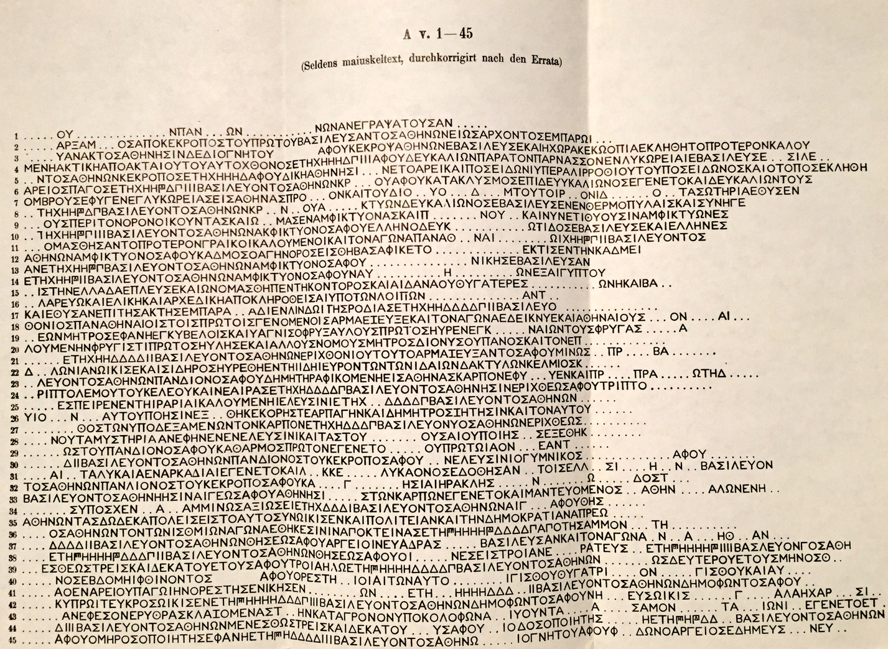
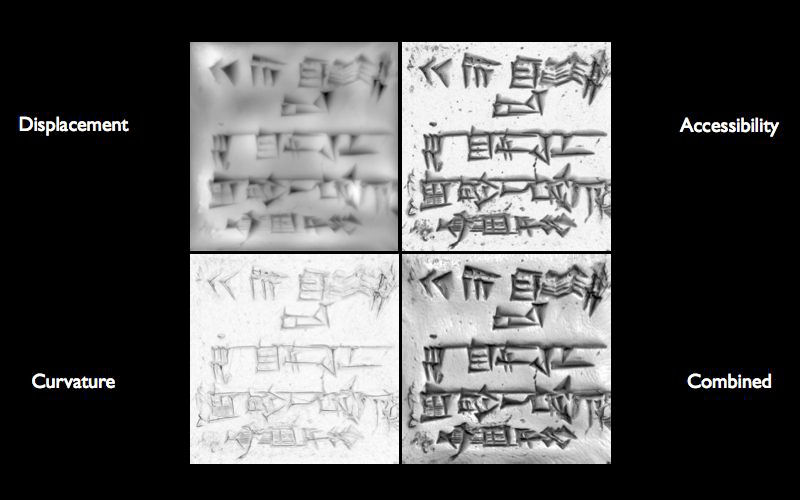
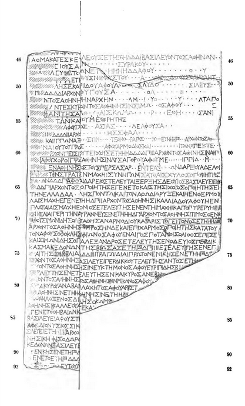
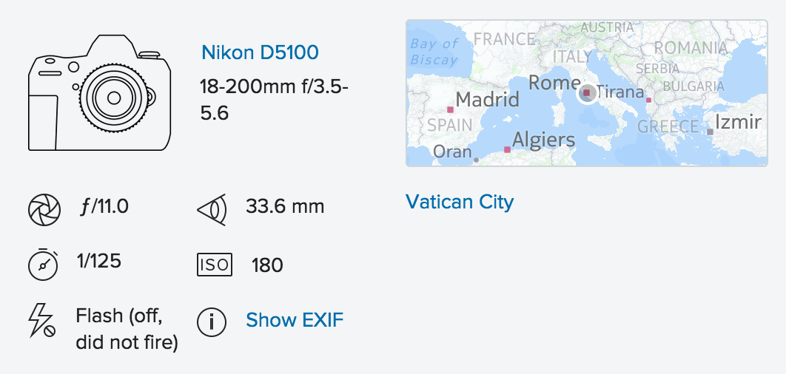

# Epigraphic Imaging
## Ryan Baumann

---

# Techniques

* Diplomatic Transcriptions
* Illustrations
* Squeezes
* Photographs
* Raking Light / PTM / RTI
* 3D

---

# Transcriptions

---

# Illustrations

<!-- .slide: data-background="../assets/Epigraphic_Imaging/digital_squeeze_007.jpg" -->

<!-- .slide: data-background="../assets/Epigraphic_Imaging/digital_squeeze_008.jpg" -->

---

# Squeezes

<!-- .slide: data-background="../assets/Epigraphic_Imaging/digital_squeeze_001.jpg" -->

<!-- .slide: data-background="../assets/Epigraphic_Imaging/digital_squeeze_002.jpg" -->

<!-- .slide: data-background="../assets/Epigraphic_Imaging/digital_squeeze_003.jpg" -->

<!-- .slide: data-background="../assets/Epigraphic_Imaging/digital_squeeze_004.jpg" -->

---

# Photographs

<!-- .slide: data-background="../assets/Epigraphic_Imaging/digital_squeeze_005.jpg" -->

<!-- .slide: data-background="../assets/Epigraphic_Imaging/digital_squeeze_009.jpg" -->

<!-- .slide: data-background="../assets/Epigraphic_Imaging/digital_squeeze_010.jpg" -->

<!-- .slide: data-background="../assets/Epigraphic_Imaging/rome_1.jpg" -->

<!-- .slide: data-background="../assets/Epigraphic_Imaging/rome_2.jpg" -->

<!-- .slide: data-background="../assets/Epigraphic_Imaging/digital_squeeze_019.jpg" -->

---

# Raking Light

* PTM = Polynomial Texture Mapping<!-- .element: class="fragment" -->
* RTI = Reflectance Transform Imaging<!-- .element: class="fragment" -->
* PTM = RTI<!-- .element: class="fragment" -->

<iframe data-src="https://player.vimeo.com/video/33252302" width="1000" height="562" frameborder="0" webkitallowfullscreen mozallowfullscreen allowfullscreen></iframe>

<iframe data-src="https://player.vimeo.com/video/96098811" width="1000" height="562" frameborder="0" webkitallowfullscreen mozallowfullscreen allowfullscreen></iframe>

---

# 3D

* Surface scan (laser, structured light, etc.)
* Photogrammetry
* CT / X-ray etc.

<!-- .slide: data-background="../assets/Epigraphic_Imaging/structured_light.jpg" -->

<!-- .slide: data-background="../assets/Epigraphic_Imaging/photogrammetry_photos.jpg" -->

<iframe width="1024" height="768" data-src="https://sketchfab.com/models/21ed34b5c79c40968e5d2d81f1d7b633/embed" frameborder="0" allowfullscreen mozallowfullscreen="true" webkitallowfullscreen="true" onmousewheel=""></iframe>

<!-- .slide: data-background="../assets/Epigraphic_Imaging/Federico_Halbherr_Gortyn.jpg" -->

<!-- .slide: data-background="../assets/Epigraphic_Imaging/12-Gortyn_code_of_laws_fs.jpg" -->

<!-- .slide: data-background="../assets/Epigraphic_Imaging/gortyn_photogrammetry.jpg" -->

<!-- .slide: data-background="../assets/Epigraphic_Imaging/digital_squeeze_066.jpg" -->

<!-- .slide: data-background="../assets/Epigraphic_Imaging/digital_squeeze_067.jpg" -->

<!-- .slide: data-background="../assets/Epigraphic_Imaging/digital_squeeze_068.jpg" -->

<!-- .slide: data-background="../assets/Epigraphic_Imaging/digital_squeeze_013.jpg" -->

<!-- .slide: data-background="../assets/Epigraphic_Imaging/digital_squeeze_026.jpg" -->

<!-- .slide: data-background="../assets/Epigraphic_Imaging/digital_squeeze_027.jpg" -->

<!-- .slide: data-background="../assets/Epigraphic_Imaging/digital_squeeze_028.jpg" -->

<!-- .slide: data-background="../assets/Epigraphic_Imaging/digital_squeeze_029.jpg" -->

<!-- .slide: data-background="../assets/Epigraphic_Imaging/digital_squeeze_014.jpg" -->

<!-- .slide: data-background="../assets/Epigraphic_Imaging/digital_squeeze_015.jpg" -->

<!-- .slide: data-background="../assets/Epigraphic_Imaging/digital_squeeze_016.jpg" -->

<!-- .slide: data-background="../assets/Epigraphic_Imaging/digital_squeeze_006.jpg" -->

<!-- .slide: data-background="../assets/Epigraphic_Imaging/digital_squeeze_073.jpg" -->

<!-- .slide: data-background="../assets/Epigraphic_Imaging/digital_squeeze_068.jpg" -->

<!-- .slide: data-background="../assets/Epigraphic_Imaging/digital_squeeze_069.jpg" -->

<!-- .slide: data-background="../assets/Epigraphic_Imaging/digital_squeeze_070.jpg" -->

<!-- .slide: data-background="../assets/Epigraphic_Imaging/digital_squeeze_071.jpg" -->

<iframe width="640" height="480" data-src="https://www.youtube.com/embed/CzHT-BBmGEM" frameborder="0" allowfullscreen></iframe>

<iframe width="640" height="480" data-src="https://www.youtube.com/embed/gSA65utz_30" frameborder="0" allowfullscreen></iframe>

<!-- .slide: data-background="../assets/Epigraphic_Imaging/xrf.jpg" -->

---

# Metadata

* Metadata
* Metadata
* Metadata

<!-- .slide: data-background="../assets/Epigraphic_Imaging/digital_squeeze_008.jpg" -->

<!-- .slide: data-background="../assets/Epigraphic_Imaging/digital_squeeze_009.jpg" -->

# Metadata

* What the image is of
* Date, location
* Ruler
* Imaging parameters
* License

# EXIF

---

# Geo

* [Pleiades](http://pleiades.stoa.org/)
* [GeoNames](http://www.geonames.org/)
* [Getty TGN](http://www.getty.edu/research/tools/vocabularies/tgn/)
* [al-Thurayyā](http://maximromanov.github.io/2014/11-20.html)
* AWMC ([Antiquity À-la-carte](http://awmc.unc.edu/awmc/applications/alacarte/))
* GeoJSON, RDF, shapefiles
* [Let's Make a Map](http://bost.ocks.org/mike/map/)

<iframe data-src="http://bl.ocks.org/ryanfb/raw/4ef9795dcfc8063a2e99/" width="1024" height="768"></iframe>

