## Geomining the Ancient World
#### Ryan Baumann
#### Duke Collaboratory for Classics Computing

---

 

# Data Mining Geospatial Data About the Ancient World

---

# What is Geospatial Data?

<!-- .slide: data-background="../assets/Geomining_the_Ancient_World/eiffel_paris.jpg" -->

<!-- .slide: data-background="../assets/Geomining_the_Ancient_World/botticelli_paris.jpg" -->

<!-- .slide: data-background="../assets/Geomining_the_Ancient_World/ky_paris.jpg" -->

<!-- .slide: data-background="../assets/Geomining_the_Ancient_World/osm_paris.jpg" -->

<!-- .slide: data-background="../assets/Geomining_the_Ancient_World/aral.jpg" -->

<!-- .slide: data-background="../assets/Geomining_the_Ancient_World/aralkum.jpg" -->

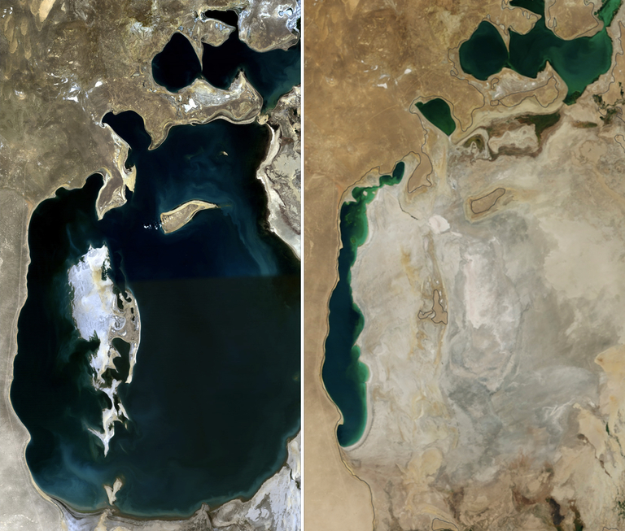

---

What does geospatial data look like?
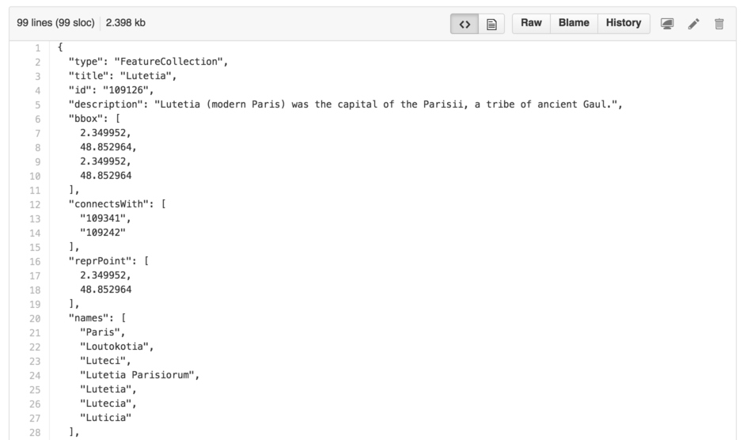 <!-- .element: class="fragment" -->

<!-- .slide: data-background-video-loop="true" data-background-video="../assets/Geomining_the_Ancient_World/d3broke.mp4" -->
`#d3brokeandmadeart`

---

## What can we do by data mining geospatial data?
* Statistics <!-- .element: class="fragment" -->
* Visualization <!-- .element: class="fragment" -->
* Analysis / Search / Discovery <!-- .element: class="fragment" -->

Roman Amphitheater Elevation
<!-- .element: style="background: white; width: 768px;" -->
<http://rpubs.com/sfsheath/amphitheater-histograms>

Roman Amphitheater Density
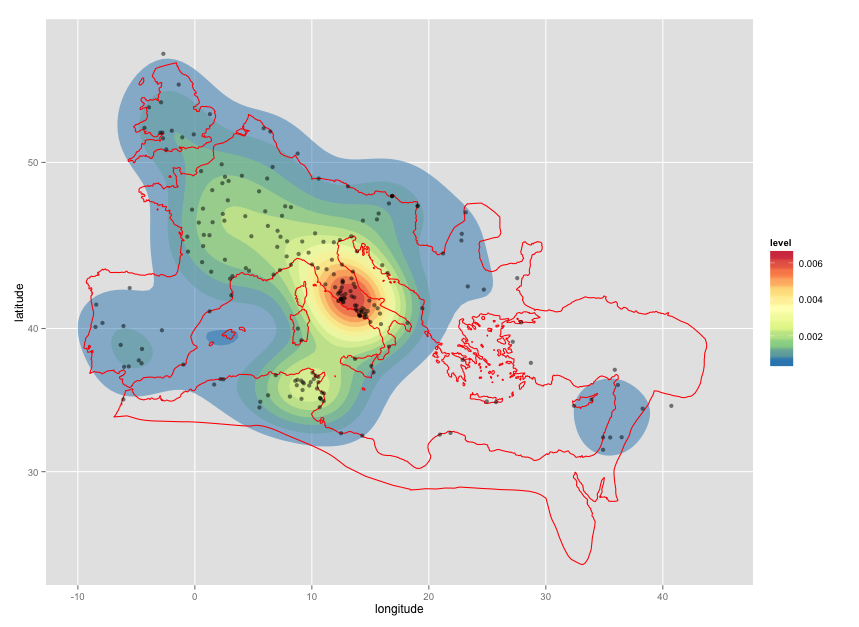<!-- .element: style="background: white; width: 768px;" -->
<https://twitter.com/sebhth/status/576461235115413504>

Roman Amphitheaters vs. Roman Empire
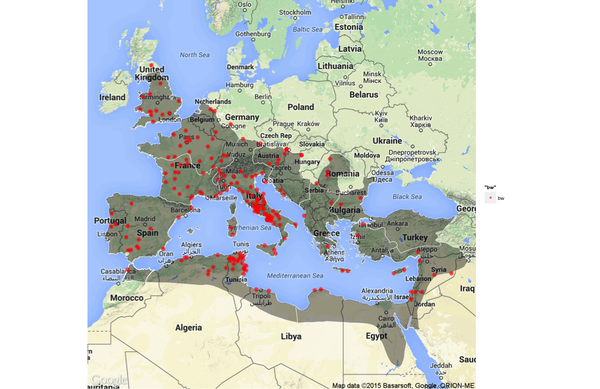<!-- .element: style="background: white; width: 768px;" -->
<https://twitter.com/sebhth/status/565726866288693251>

---

# Spatial Relationships
* Distance<!-- .element: class="fragment" data-fragment-index="1" -->
* Equals<!-- .element: class="fragment" data-fragment-index="2" -->
* Contains<!-- .element: class="fragment" data-fragment-index="2" -->
* Touches<!-- .element: class="fragment" data-fragment-index="2" -->
* Within<!-- .element: class="fragment" data-fragment-index="2" -->
* Overlaps<!-- .element: class="fragment" data-fragment-index="2" -->
* Crosses<!-- .element: class="fragment" data-fragment-index="2" -->
* Intersects<!-- .element: class="fragment" data-fragment-index="2" -->
* Disjoint<!-- .element: class="fragment" data-fragment-index="2" -->

# Distance
    a = sin²(Δφ/2) + cos φ1 ⋅ cos φ2 ⋅ sin²(Δλ/2)
    c = 2 ⋅ atan2( √a, √(1−a) )
    d = R ⋅ c
Where φ is latitude, λ is longitude, R is Earth's radius

(mean radius = 6,371km)

# Spatial Relationships
* Equals - all points equal
* Disjoint - no points in common
* Within, Contains - one geometry is completely within another
* Overlaps - some points in common, but not all
* Intersects - at least one point in common
* Touches - at least one boundary point in common, but no interior points in common
* Crosses - the geometries actually overlap edges, e.g. a line crossing into a polygon

---

# Formats
* GeoJSON - open, .json, .geojson 
* TopoJSON - GeoJSON extension, .json, .topojson 
* Shapefiles - ESRI, .shp, .shx, .dbf 
* Geography Markup Language -  OGC, .gml, .xml 
* Keyhole Markup Language - Google, .kml, .kmz 
* OSM - OpenStreetMap, .osm
* WKT - "well-known text", .wkt, .wkb
* CSV - "comma-separated values", .csv

---

# Tools
* QGIS
* GDAL
* R
* D3, Leaflet, Mapbox, Google Maps
* GRASS GIS
* GeoRefine
* PostGIS
* ArcGIS 👎<!-- .element: class="fragment" -->

---

# Geocoding
* Geocoding - name to geospatial data<!-- .element: class="fragment" -->
* Reverse-Geocoding - geospatial data to name<!-- .element: class="fragment" -->

# Geocoding Resources
* Google Fusion Tables
* <http://www.findlatitudeandlongitude.com/batch-geocode/>
* <http://sandbox.idre.ucla.edu/geocoder/>
* Google, MapQuest, Yahoo, Bing APIs
* Google Earth Pro (now free)

---

# Resources

<!-- .slide: data-background="../assets/Geomining_the_Ancient_World/pleiades.jpg" -->

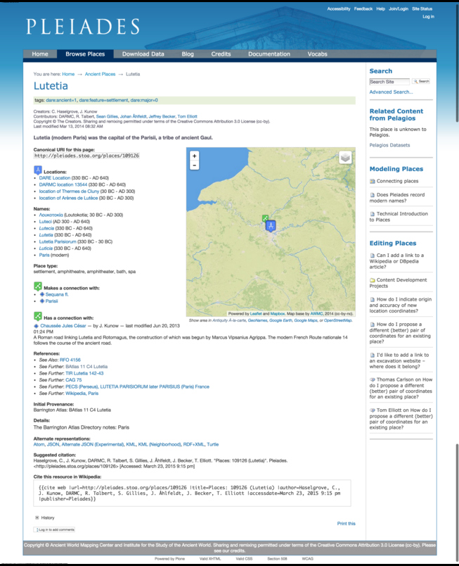

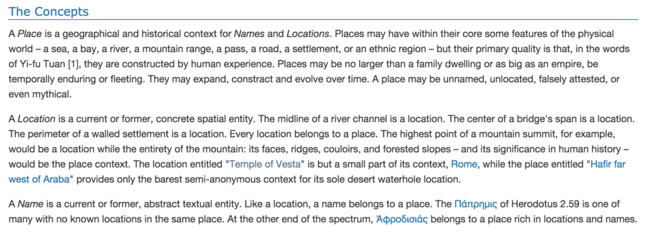

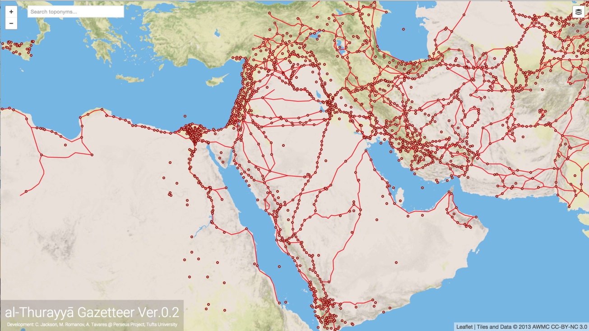
<http://maximromanov.github.io/althurayya/>

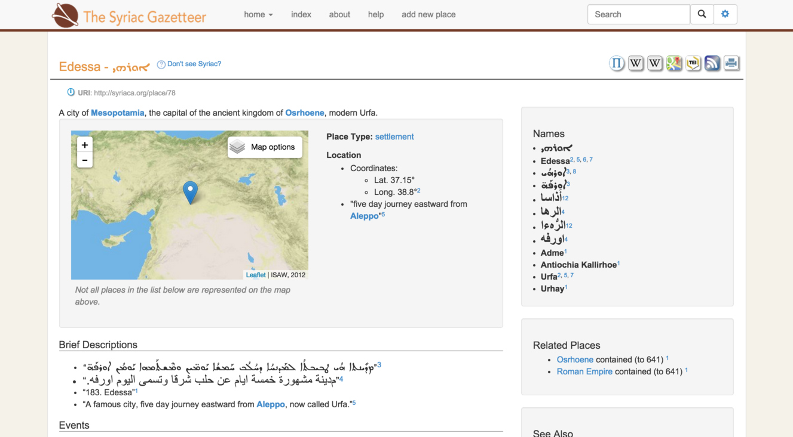
<http://syriaca.org/geo/>

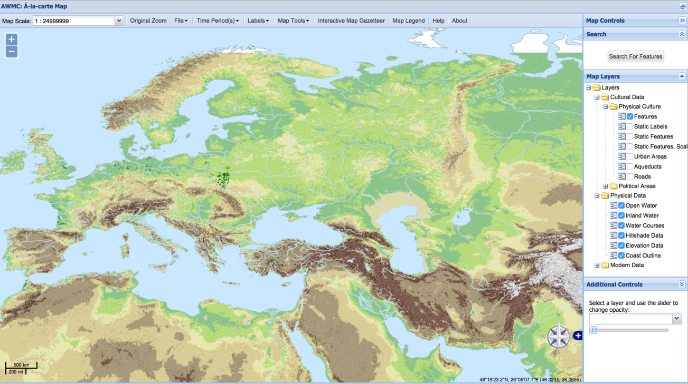

# Modern GIS Resources
* GeoNames.org
* Getty Thesaurus of Geographic Names (TGN)
* OpenStreetMap
* [Natural Earth](http://www.naturalearthdata.com/)

---

# Pelagios

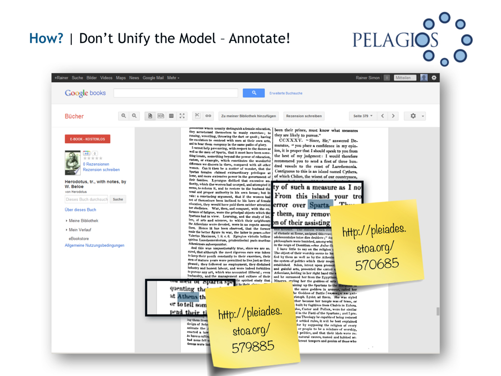

#### Pelagios Datasets
* Pelagios 3 - Early Geospatial Documents
* CLAROS - art and archaeology
* American Numismatic Society - coins
* Arachne - German Archaeological Institute
* Open Context - research data in archaeology
* Epigraphic Database Heidelberg - Latin inscriptions
* Papyri.info - places of origin & findspots for papyri
* Nomisma.org - numsimatic concepts
* Flickr Machine Tags - images

#### Pelagios Datasets
* Google Ancient Places - Classical texts from Google Books
* Pleiades Annotations in the Perseus Digital Library
* Portable Antiquities Scheme - archaeological objects
* AIAC Fasti Online - archaeological excavations
* SPQR - inscriptions
* Omnes Viae - road network of the Tabula Peutingeriana
* Vici.org - places, findspots, buildings
* Ure Museum - Greek archaeology
* Digital Atlas of the Roman Empire

# Recogito
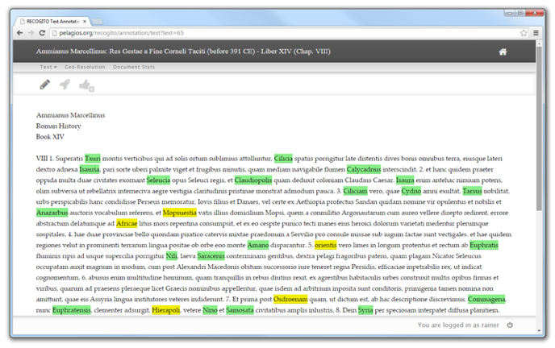

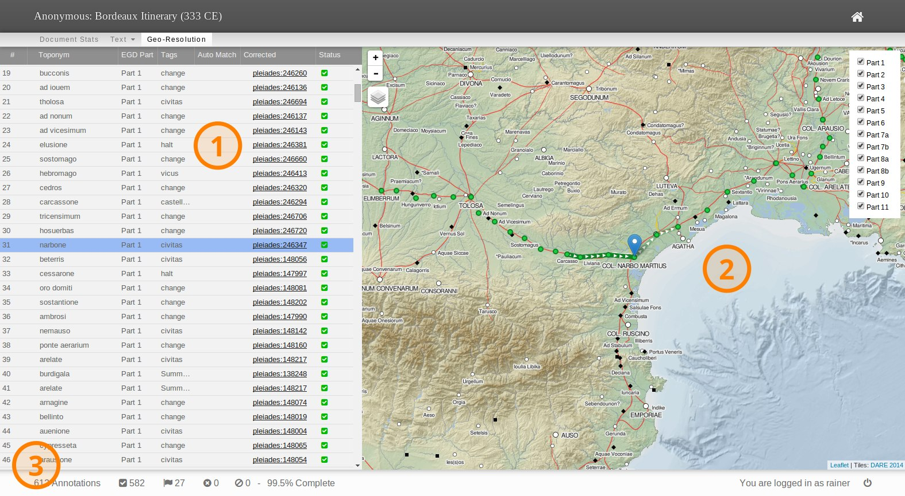

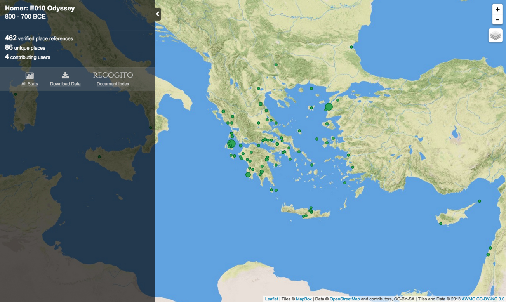

---

# Examples

Pleiades+

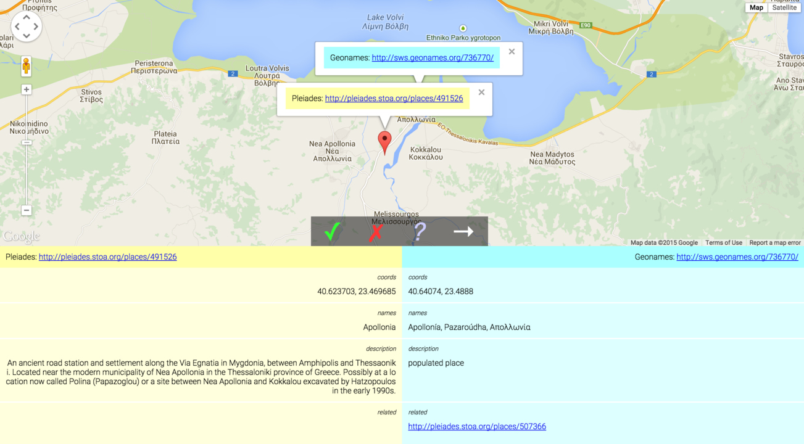

<http://pleiades-plus-gazcomp.appspot.com/>

<!-- .slide: data-background="../assets/Geomining_the_Ancient_World/vicarello.jpg" -->
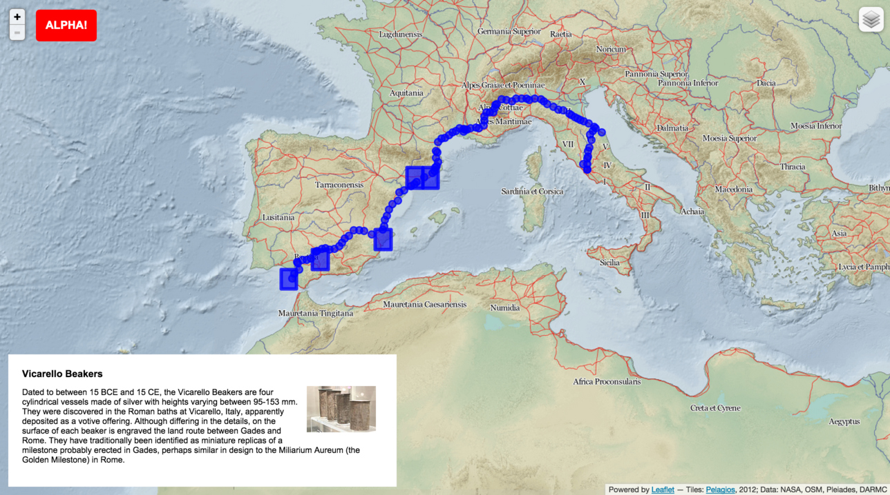<!-- .element: class="fragment" -->

Itinerarium

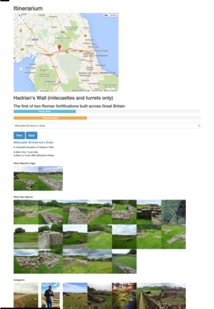

<http://ryanfb.github.io/itinerarium/>

---

[Distribution of texts/collections in Trismegistos](http://bl.ocks.org/ryanfb/4ef9795dcfc8063a2e99)
<iframe data-src="http://bl.ocks.org/ryanfb/raw/4ef9795dcfc8063a2e99/" width="1024" height="768"></iframe>

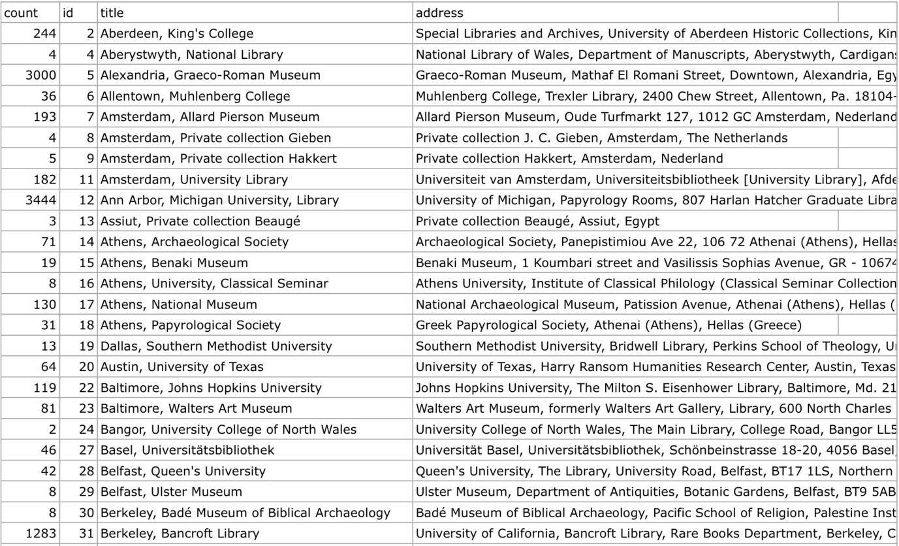

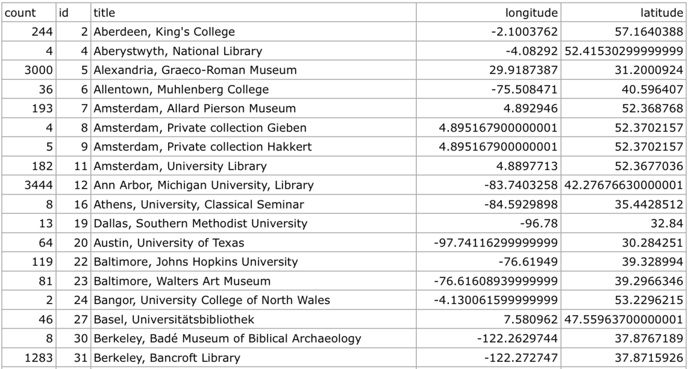

<!-- .slide: data-background="../assets/Geomining_the_Ancient_World/tm_earth.jpg" -->

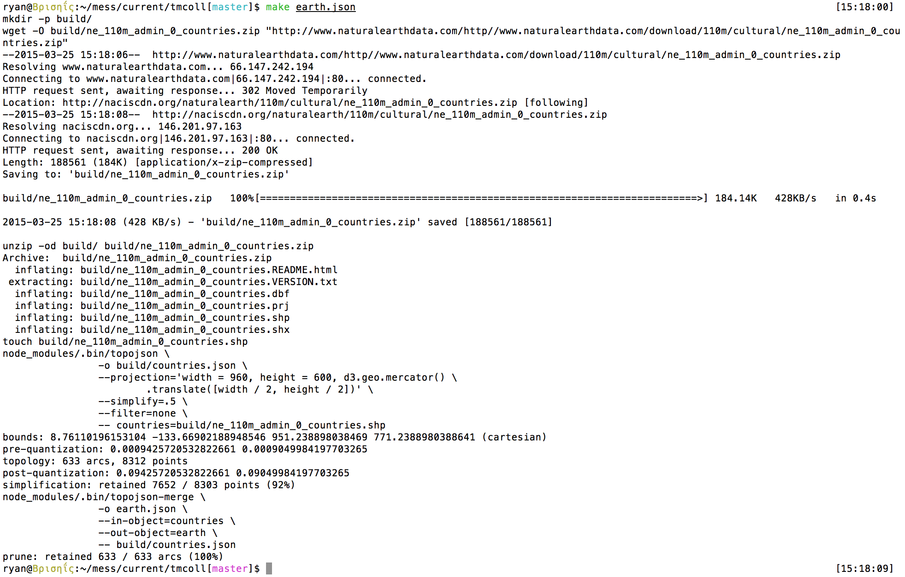

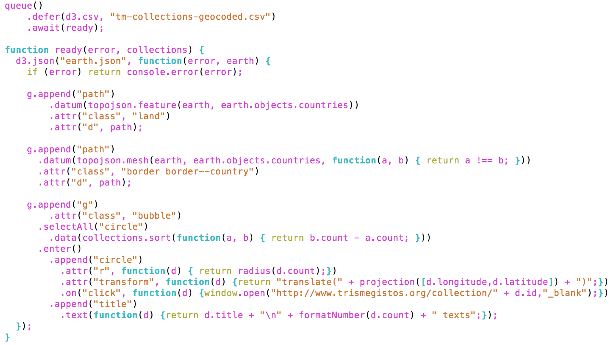

[Distribution of texts/collections in Trismegistos](http://bl.ocks.org/ryanfb/4ef9795dcfc8063a2e99)
<iframe data-src="http://bl.ocks.org/ryanfb/raw/4ef9795dcfc8063a2e99/" width="1024" height="768"></iframe>

---

#### [Data science done well looks easy](http://simplystatistics.org/2015/03/17/data-science-done-well-looks-easy-and-that-is-a-big-problem-for-data-scientists/)

1. Define the question of interest<!-- .element: class="fragment" -->
2. Get the data<!-- .element: class="fragment" -->
3. Clean the data<!-- .element: class="fragment" -->
4. Explore the data<!-- .element: class="fragment" -->
5. Fit statistical models<!-- .element: class="fragment" -->
6. Communicate the results<!-- .element: class="fragment" -->
7. Make your analysis reproducible<!-- .element: class="fragment" -->

<blockquote class="fragment">"After a ton of work like that, you have a nice set of data to which you fit simple statistical models and then it looks <strong>super easy</strong> to someone who either doesn't know about the data collection and cleaning process or doesn't care."</blockquote>

---

# The End

<http://dcthree.github.io/presentations/>
