## Work in Progress at DC3
## Latin OCR
#### Ryan Baumann
#### Duke Collaboratory for Classics Computing

---

# What's OCR?
<u>**O**</u>ptical <u>**C**</u>haracter <u>**R**</u>ecognition<!-- .element: class="fragment" data-fragment-index="1" -->

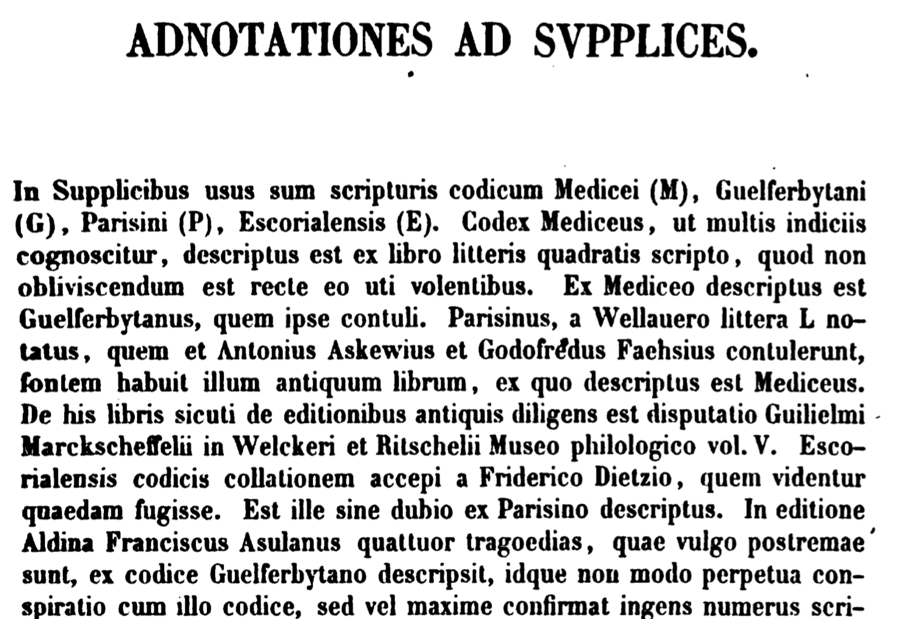<!-- .element: class="fragment" style="background: white; width: 384px;" data-fragment-index="2" -->
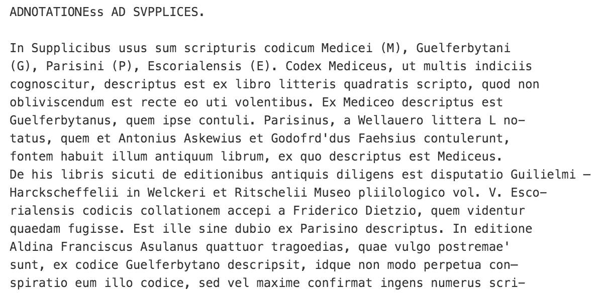<!-- .element: class="fragment" style="background: white; width: 500px;" data-fragment-index="3" -->

* Search<!-- .element: class="fragment" data-fragment-index="4" -->
* Copy/Paste<!-- .element: class="fragment" data-fragment-index="4" -->
* Text Mining<!-- .element: class="fragment" data-fragment-index="4" -->
* Machine Translation<!-- .element: class="fragment" data-fragment-index="4" -->

---

## Why do we need "Latin OCR"?
* Thousands of volumes printed in (Neo-)Latin, now scanned
* OCR uses character training and language model to recognize characters
* Existing OCR solutions are mostly developed:
 * For Latin characters in *modern* fonts
 * For modern non-Latin languages that happen to use Latin characters (e.g. English)
* Many existing OCR solutions are closed "black boxes"
 * Can't adapt/improve them for our needs

<!-- .element: style="background: white; width: 250px;" -->

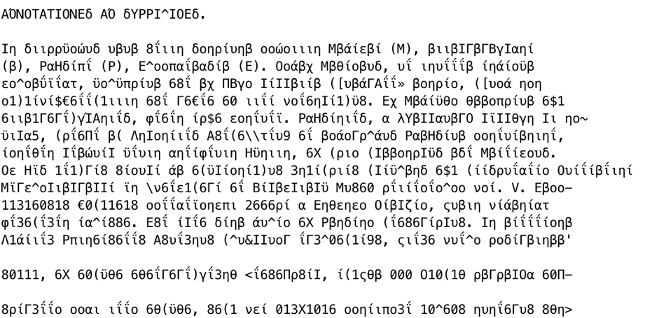<!-- .element: class="fragment" style="background: white; width: 500px;" data-fragment-index="1" -->
<!-- .element: class="fragment" style="background: white; width: 500px;" data-fragment-index="2" -->

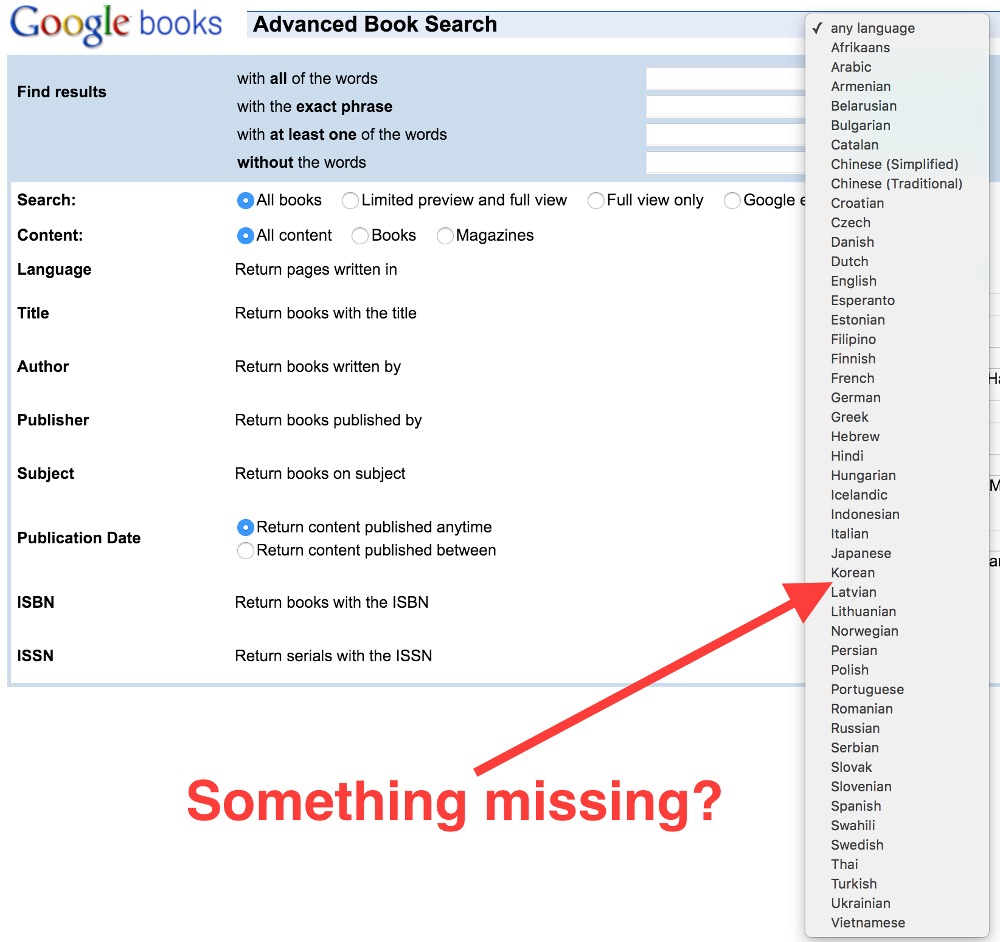<!-- .element: style="background: white; width: 600px;" -->

---

## What do we need to do to develop Latin OCR?
* Develop Latin-specific OCR processes
* Run OCR on existing Latin page scans
* Evaluate and improve results

---

## Develop Latin-specific OCR processes
* Currently using the open-source Tesseract OCR engine
* Select synthetic fonts that are similar to historic fonts 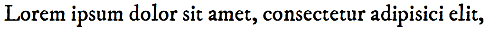<!-- .element: style="background: white; width: 768px;" -->
* Build a Latin-specific dictionary and word frequency table
* Use dictionary and fonts to generate thousands of pages of random text, and corresponding randomly-degraded page images
* Since we know what text we generated, training process can learn character shapes for degraded page images
* Final OCR process uses Latin-specific dictionary and word frequency to guess uncertain words

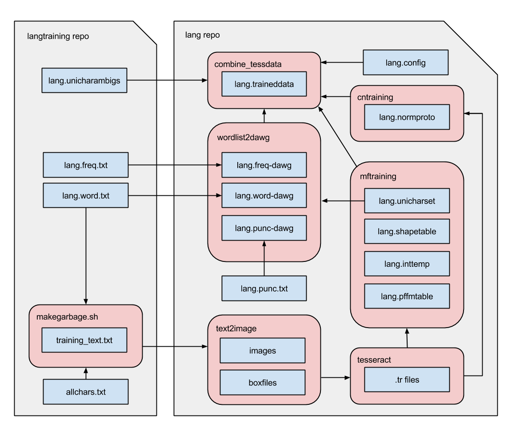<!-- .element: style="background: white; width: 768px;" -->

---

## Run OCR on existing Latin page scans
* Initial corpus of 21,509 volumes identified as Latin or likely-Latin in the Internet Archive
 * Approximately 2.8 billion words of Latin
* Running on Duke Research Computing SLURM cluster
 * Lets us do OCR at scale
 * Currently at 12,159 volumes OCR'd
* Potentially tens of thousands of other scanned Latin volumes remain in waiting... \*gulp\*

---

## Evaluate and improve results
* Easy to evaluate OCR quality if you have a known-good manual transcription of what you want
* How do you evaluate OCR quality for arbitrary unknown text?
 * Use a statistical language model
 * In this case, `langid`

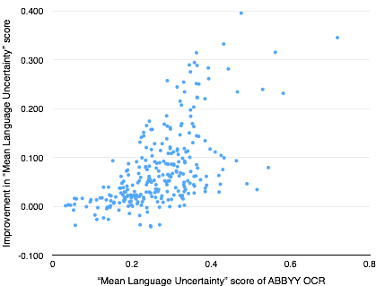<!-- .element: style="background: white; width: 400px;" --> 

<!-- .element: style="background: white; width: 250px;" -->

<!-- .element: style="background: white; height: 200px;" -->
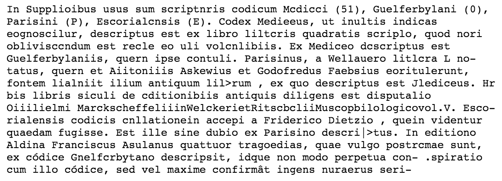<!-- .element: style="background: white; height: 200px;" -->
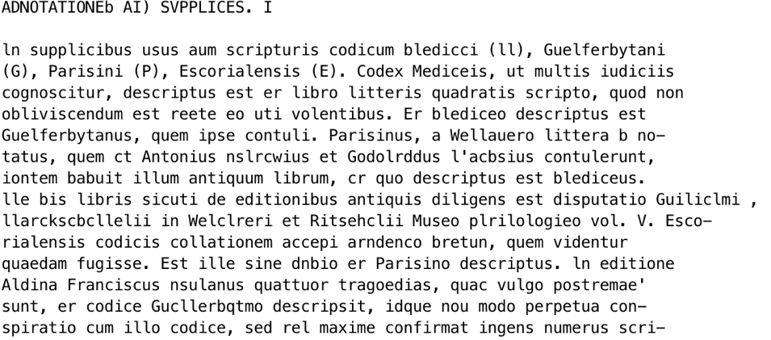<!-- .element: style="background: white; height: 200px;" -->
<!-- .element: style="background: white; height: 200px;" -->

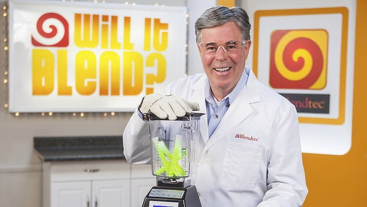<!-- .element: style="width: 768px;" -->

---

## Bonus: Book Alignment

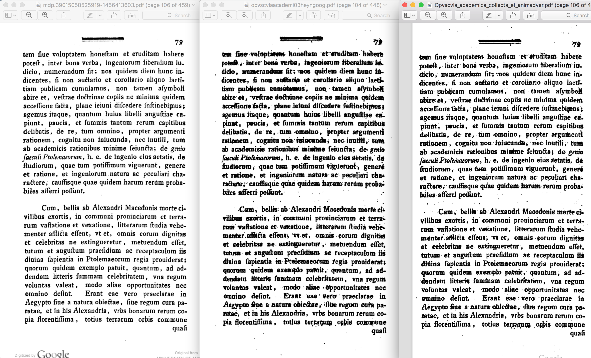<!-- .element: style="width: 768px;" -->

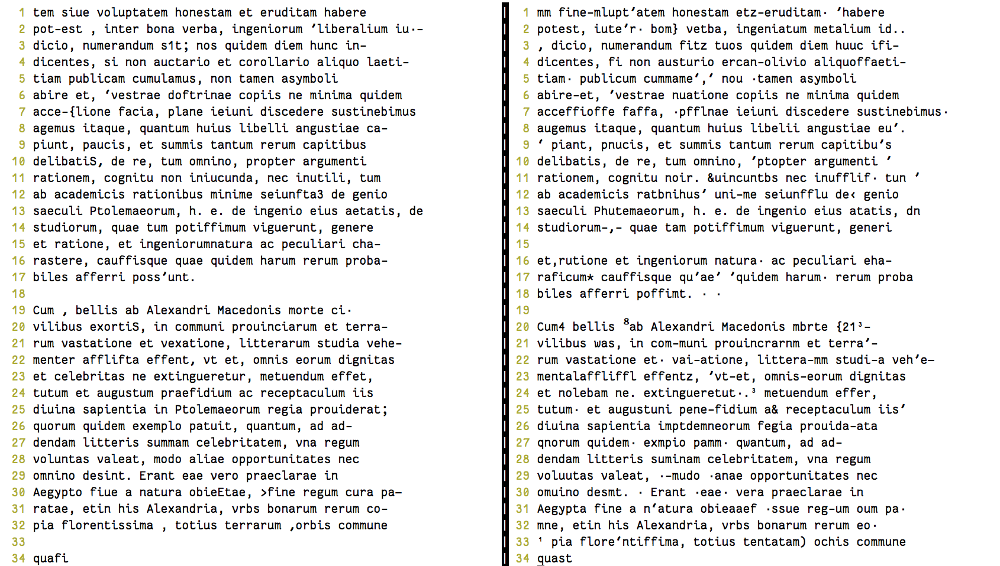<!-- .element: style="width: 768px;" -->

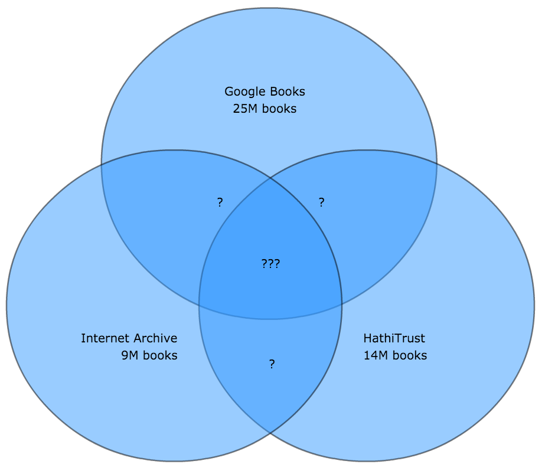<!-- .element: style="width: 768px;" -->

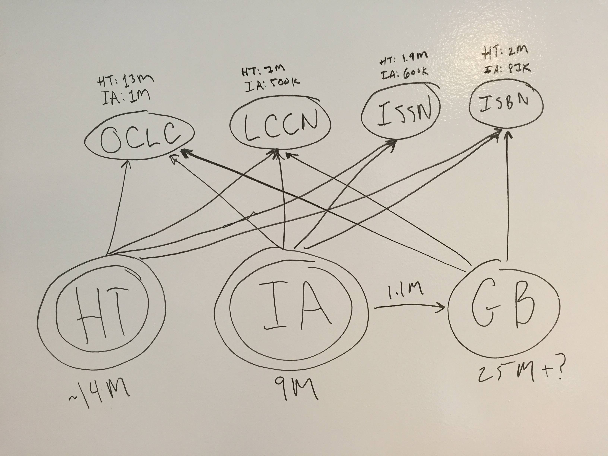<!-- .element: style="width: 768px;" -->

<http://ryanfb.github.io/book-aligner/>

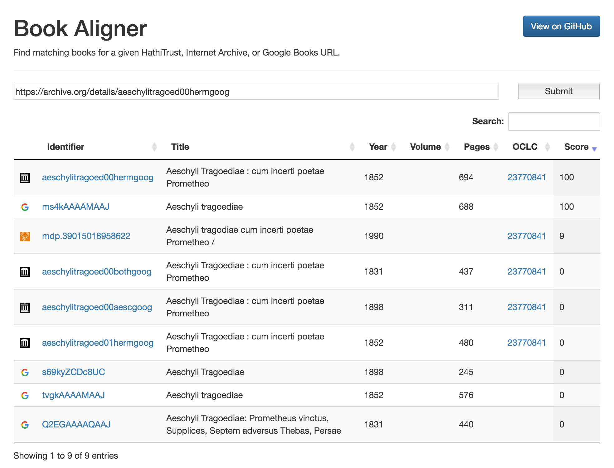<!-- .element: style="width: 768px;" -->

---

# the end

* <http://latin-ocr.github.io/>
* <http://tinyurl.com/ocrquality>
* <http://ryanfb.github.io/book-aligner/>
* <http://ryanfb.github.io/latinocr/>
* <http://dcthree.github.io/presentations/>
