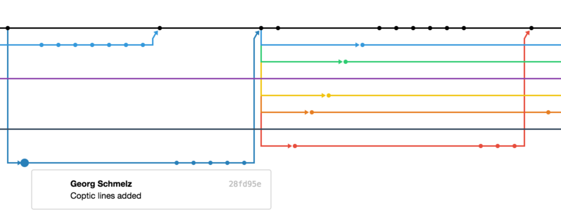

## Shifting Frontiers in the Digital Humanities
#### Ryan Baumann
#### Duke Collaboratory for Classics Computing

## What this talk won't answer:<!-- .element: class="fragment" data-fragment-index="5" -->
* What are the digital humanities?<!-- .element: class="fragment" data-fragment-index="1" -->
* What are the humanities?<!-- .element: class="fragment" data-fragment-index="2" -->
* What are the humanities good for?<!-- .element: class="fragment" data-fragment-index="3" -->
* What are the digital humanities good for?<!-- .element: class="fragment" data-fragment-index="4" -->

<!-- .slide: data-background="../assets/Shifting_Frontiers/fermat.jpg" -->

---

<http://papyri.info/editor/>

<https://github.com/papyri/idp.data/>

> “We no longer see IDP as representing at any given moment a synthesis of fixed data sources directed by a central management; rather, we see it as a constantly changing set of fully open data sources governed by the scholarly community and maintained by all active scholars who care to participate. One might go so far as to say that we see this nexus of papyrological resources as ceasing to be “projects” and turning instead into a community.”

—Roger Bagnall
